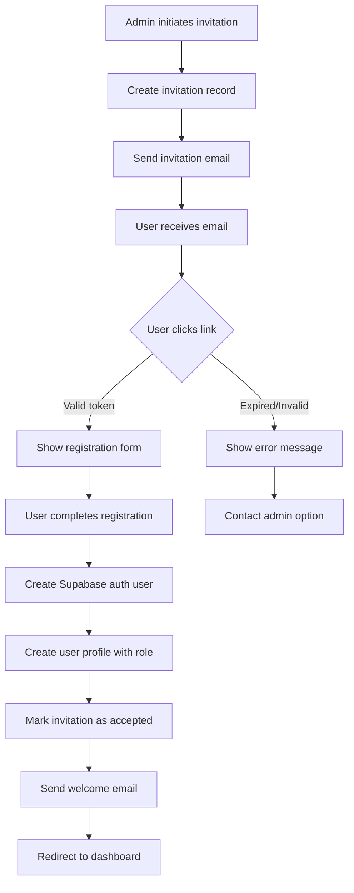

# User Roles and Permissions System Specification

## Overview

This document outlines the design and implementation plan for a comprehensive user management system for the ESNYC Lesson Search application, including role-based access control, user invitation workflow, and admin management interface.

## Current State Analysis

### Existing Implementation
- **Authentication**: Supabase Auth
- **User Profiles**: `user_profiles` table with basic role field
- **Roles**: Three hardcoded roles: `teacher`, `reviewer`, `admin`
- **Role Checking**: Simple string comparison in components
- **Limitations**: 
  - No invitation system
  - No granular permissions
  - No admin UI for user management
  - Role changes require direct database access

## Proposed System Architecture

### 1. Enhanced Role System

#### Role Definitions

```typescript
enum UserRole {
  TEACHER = 'teacher',
  REVIEWER = 'reviewer', 
  ADMIN = 'admin',
  SUPER_ADMIN = 'super_admin'
}

enum Permission {
  // Lesson Management
  VIEW_LESSONS = 'view_lessons',
  SUBMIT_LESSONS = 'submit_lessons',
  REVIEW_LESSONS = 'review_lessons',
  APPROVE_LESSONS = 'approve_lessons',
  DELETE_LESSONS = 'delete_lessons',
  
  // User Management
  VIEW_USERS = 'view_users',
  INVITE_USERS = 'invite_users',
  EDIT_USERS = 'edit_users',
  DELETE_USERS = 'delete_users',
  MANAGE_ROLES = 'manage_roles',
  
  // Admin Features
  VIEW_ANALYTICS = 'view_analytics',
  MANAGE_DUPLICATES = 'manage_duplicates',
  EXPORT_DATA = 'export_data',
  SYSTEM_SETTINGS = 'system_settings'
}
```

#### Default Role Permissions

```typescript
const DEFAULT_PERMISSIONS: Record<UserRole, Permission[]> = {
  [UserRole.TEACHER]: [
    Permission.VIEW_LESSONS,
    Permission.SUBMIT_LESSONS
  ],
  
  [UserRole.REVIEWER]: [
    Permission.VIEW_LESSONS,
    Permission.SUBMIT_LESSONS,
    Permission.REVIEW_LESSONS,
    Permission.APPROVE_LESSONS,
    Permission.VIEW_ANALYTICS
  ],
  
  [UserRole.ADMIN]: [
    Permission.VIEW_LESSONS,
    Permission.SUBMIT_LESSONS,
    Permission.REVIEW_LESSONS,
    Permission.APPROVE_LESSONS,
    Permission.DELETE_LESSONS,
    Permission.VIEW_USERS,
    Permission.INVITE_USERS,
    Permission.EDIT_USERS,
    Permission.VIEW_ANALYTICS,
    Permission.MANAGE_DUPLICATES,
    Permission.EXPORT_DATA
  ],
  
  [UserRole.SUPER_ADMIN]: [
    // All permissions
    ...Object.values(Permission)
  ]
};
```

### 2. Database Schema

#### Enhanced User Profiles Table

```sql
-- Extend user_profiles table
ALTER TABLE user_profiles
ADD COLUMN IF NOT EXISTS invited_by UUID REFERENCES auth.users(id),
ADD COLUMN IF NOT EXISTS invited_at TIMESTAMPTZ,
ADD COLUMN IF NOT EXISTS accepted_at TIMESTAMPTZ,
ADD COLUMN IF NOT EXISTS is_active BOOLEAN DEFAULT true,
ADD COLUMN IF NOT EXISTS school_name TEXT,
ADD COLUMN IF NOT EXISTS school_borough TEXT,
ADD COLUMN IF NOT EXISTS grades_taught TEXT[],
ADD COLUMN IF NOT EXISTS subjects_taught TEXT[],
ADD COLUMN IF NOT EXISTS notes TEXT;

-- Create index for performance
CREATE INDEX IF NOT EXISTS idx_user_profiles_role ON user_profiles(role);
CREATE INDEX IF NOT EXISTS idx_user_profiles_is_active ON user_profiles(is_active);
```

#### User Invitations Table

```sql
CREATE TABLE IF NOT EXISTS user_invitations (
  id UUID PRIMARY KEY DEFAULT gen_random_uuid(),
  email TEXT NOT NULL,
  role TEXT NOT NULL CHECK (role IN ('teacher', 'reviewer', 'admin')),
  invited_by UUID NOT NULL REFERENCES auth.users(id),
  invited_at TIMESTAMPTZ NOT NULL DEFAULT NOW(),
  expires_at TIMESTAMPTZ NOT NULL DEFAULT NOW() + INTERVAL '7 days',
  accepted_at TIMESTAMPTZ,
  token TEXT UNIQUE NOT NULL DEFAULT gen_random_uuid()::TEXT,
  metadata JSONB DEFAULT '{}',
  school_name TEXT,
  message TEXT,
  created_at TIMESTAMPTZ NOT NULL DEFAULT NOW(),
  
  CONSTRAINT unique_pending_invitation UNIQUE (email) WHERE accepted_at IS NULL
);

-- Create indexes
CREATE INDEX idx_invitations_email ON user_invitations(email);
CREATE INDEX idx_invitations_token ON user_invitations(token);
CREATE INDEX idx_invitations_expires_at ON user_invitations(expires_at) WHERE accepted_at IS NULL;
```

#### Audit Trail Table

```sql
CREATE TABLE IF NOT EXISTS user_management_audit (
  id UUID PRIMARY KEY DEFAULT gen_random_uuid(),
  actor_id UUID NOT NULL REFERENCES auth.users(id),
  action TEXT NOT NULL,
  target_user_id UUID REFERENCES auth.users(id),
  target_email TEXT,
  old_values JSONB,
  new_values JSONB,
  ip_address INET,
  user_agent TEXT,
  created_at TIMESTAMPTZ NOT NULL DEFAULT NOW()
);

CREATE INDEX idx_audit_actor ON user_management_audit(actor_id);
CREATE INDEX idx_audit_target ON user_management_audit(target_user_id);
CREATE INDEX idx_audit_created ON user_management_audit(created_at);
```

### 3. User Management Features

#### Admin Dashboard Pages

1. **User List Page** (`/admin/users`)
   - Searchable/filterable user table
   - Quick actions (edit role, activate/deactivate)
   - Bulk operations
   - Export functionality

2. **User Detail Page** (`/admin/users/:id`)
   - Full user profile
   - Activity history
   - Submitted lessons
   - Role and permission management
   - Account actions (reset password, deactivate)

3. **Invite User Page** (`/admin/users/invite`)
   - Email invitation form
   - Role selection with permission preview
   - Custom message
   - Bulk invite via CSV

4. **Invitations Management** (`/admin/invitations`)
   - Pending invitations list
   - Resend/cancel invitations
   - Invitation analytics

### 4. Invitation Workflow

#### Flow Diagram



#### Email Templates

1. **Invitation Email**
   ```
   Subject: You're invited to join ESNYC Lesson Library
   
   Hi [Name],
   
   [Inviter Name] has invited you to join the ESNYC Lesson Library as a [Role].
   
   [Custom Message]
   
   As a [Role], you'll be able to:
   - [List of permissions based on role]
   
   Click here to accept your invitation and set up your account:
   [Invitation Link]
   
   This invitation will expire in 7 days.
   
   Best regards,
   The ESNYC Team
   ```

2. **Welcome Email**
   ```
   Subject: Welcome to ESNYC Lesson Library!
   
   Hi [Name],
   
   Your account has been successfully created. Here's what you can do:
   
   [Personalized list based on role]
   
   Get started: [Dashboard Link]
   
   Need help? Check out our [Help Documentation] or contact [Support Email]
   
   Best regards,
   The ESNYC Team
   ```

### 5. UI Components

#### Admin User Management Interface

```typescript
// User List Component
interface UserListProps {
  filters: UserFilters;
  onUserSelect: (userId: string) => void;
  onBulkAction: (action: BulkAction, userIds: string[]) => void;
}

// User Detail Component  
interface UserDetailProps {
  userId: string;
  onRoleChange: (newRole: UserRole) => void;
  onPermissionToggle: (permission: Permission) => void;
  onAccountAction: (action: AccountAction) => void;
}

// Invite User Component
interface InviteUserProps {
  onInvite: (invitation: InvitationData) => void;
  onBulkInvite: (file: File) => void;
}

// Invitation Management Component
interface InvitationListProps {
  filter: 'pending' | 'accepted' | 'expired' | 'all';
  onResend: (invitationId: string) => void;
  onCancel: (invitationId: string) => void;
}
```

### 6. API Endpoints (Supabase Functions)

#### User Management Endpoints

```typescript
// Get users with pagination and filtering
GET /api/admin/users
Query params: page, limit, search, role, isActive, sortBy, sortOrder

// Get single user details
GET /api/admin/users/:id

// Update user role/permissions
PATCH /api/admin/users/:id
Body: { role?, permissions?, isActive?, metadata? }

// Delete user (soft delete)
DELETE /api/admin/users/:id

// Bulk operations
POST /api/admin/users/bulk
Body: { action: 'activate' | 'deactivate' | 'delete', userIds: string[] }
```

#### Invitation Endpoints

```typescript
// Create invitation
POST /api/admin/invitations
Body: { email, role, message?, schoolName?, metadata? }

// Get invitations
GET /api/admin/invitations
Query params: page, limit, status, search

// Resend invitation
POST /api/admin/invitations/:id/resend

// Cancel invitation
DELETE /api/admin/invitations/:id

// Accept invitation (public endpoint)
POST /api/invitations/accept
Body: { token, password, fullName, ...profileData }
```

### 7. Security Considerations

#### Access Control
- All admin endpoints require authentication
- Role-based middleware for API routes
- Row Level Security (RLS) policies for database
- Audit trail for all user management actions

#### Invitation Security
- Cryptographically secure tokens
- Token expiration (7 days default)
- One-time use tokens
- Rate limiting on invitation endpoints
- Email verification required

#### Data Protection
- Sensitive data encryption at rest
- PII handling compliance
- Soft deletes for user accounts
- Data retention policies

### 8. Implementation Phases

#### Phase 1: Foundation (Week 1)
- [ ] Create database migrations
- [ ] Implement enhanced permission system
- [ ] Update auth hook with permission checking
- [ ] Create base admin layout and routing

#### Phase 2: User Management UI (Week 2)
- [ ] Build user list page with search/filter
- [ ] Implement user detail page
- [ ] Add role editing functionality
- [ ] Create audit trail logging

#### Phase 3: Invitation System (Week 3)
- [ ] Design invitation workflow
- [ ] Build invitation UI components
- [ ] Implement email sending
- [ ] Create public invitation acceptance flow

#### Phase 4: Advanced Features (Week 4)
- [ ] Add bulk operations
- [ ] Implement CSV import/export
- [ ] Create analytics dashboard
- [ ] Add comprehensive testing

### 9. Migration Strategy

#### For Existing Users
1. Backfill user_profiles with default metadata
2. Set all existing users to 'teacher' role by default
3. Manually promote specific users to admin/reviewer
4. Send notification about new features

#### Database Migration Order
1. Extend user_profiles table
2. Create user_invitations table
3. Create audit trail table
4. Add RLS policies
5. Create necessary indexes

### 10. Testing Requirements

#### Unit Tests
- Permission checking logic
- Invitation token generation/validation
- Role assignment logic
- Audit trail recording

#### Integration Tests
- Full invitation workflow
- User CRUD operations
- Permission enforcement
- Email sending

#### E2E Tests
- Admin can invite user
- User can accept invitation
- Role changes reflect immediately
- Audit trail captures all actions

## Success Metrics

1. **Adoption**: 80% of admins using invitation system within first month
2. **Security**: Zero unauthorized access incidents
3. **Usability**: <2 minutes average time to invite new user
4. **Reliability**: 99.9% uptime for auth services
5. **Compliance**: Full audit trail for all user management actions

## Future Enhancements

1. **SSO Integration**: Support for Google Workspace SSO
2. **Custom Roles**: Allow creation of custom roles with specific permissions
3. **Team Management**: Group users by school/organization
4. **API Keys**: Generate API keys for programmatic access
5. **2FA**: Two-factor authentication for admin accounts
6. **Activity Dashboard**: Real-time user activity monitoring