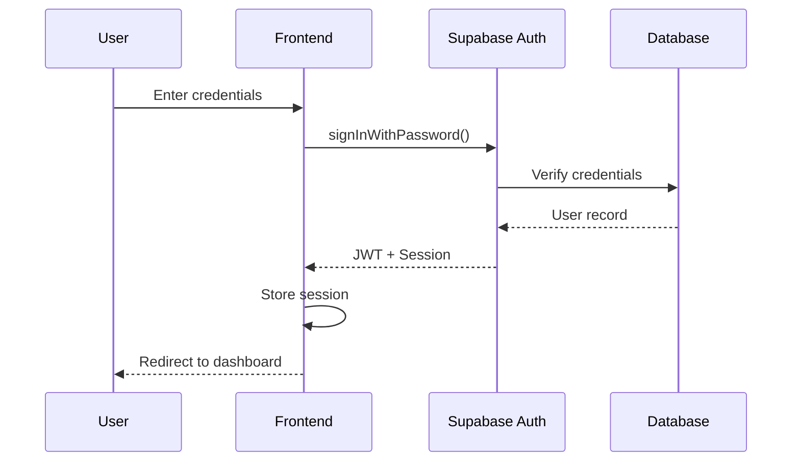
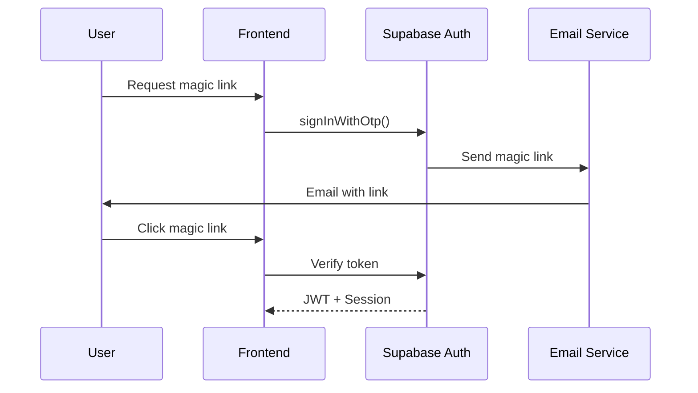

# Authentication Flow Documentation

> **Note**: This document describes both implemented features and recommended patterns. Items marked with ⚠️ are recommendations or future features.

## Overview

The ESYNYC Lesson Search platform uses Supabase Auth for secure authentication with multiple auth strategies.

## Authentication Methods

### 1. Email/Password Authentication



#### Implementation
```typescript
// Sign In
const { data, error } = await supabase.auth.signInWithPassword({
  email: 'user@example.com',
  password: 'secure-password'
});

// Sign Up
const { data, error } = await supabase.auth.signUp({
  email: 'user@example.com',
  password: 'secure-password',
  options: {
    data: {
      full_name: 'User Name',
      school: 'School Name'
    }
  }
});
```

### 2. Magic Link Authentication



#### Implementation
```typescript
// Request Magic Link
const { error } = await supabase.auth.signInWithOtp({
  email: 'user@example.com',
  options: {
    emailRedirectTo: `${window.location.origin}/auth/callback`
  }
});
```

### 3. OAuth Providers ⚠️ (Not Implemented)

Support planned for:
- Google OAuth
- Microsoft OAuth (for school accounts)

## Session Management

### Session Storage
- Sessions stored in localStorage
- Refresh tokens in httpOnly cookies (when configured)
- Auto-refresh before expiration

### Session Lifecycle
```typescript
// Check session on app load
const { data: { session } } = await supabase.auth.getSession();

// Listen for auth changes
supabase.auth.onAuthStateChange((event, session) => {
  switch(event) {
    case 'SIGNED_IN':
      // Handle sign in
      break;
    case 'SIGNED_OUT':
      // Handle sign out
      break;
    case 'TOKEN_REFRESHED':
      // Handle token refresh
      break;
    case 'USER_UPDATED':
      // Handle user updates
      break;
  }
});
```

## Token Structure

### JWT Claims
```json
{
  "aud": "authenticated",
  "exp": 1234567890,
  "sub": "user-uuid",
  "email": "user@example.com",
  "phone": "",
  "app_metadata": {
    "provider": "email",
    "providers": ["email"]
  },
  "user_metadata": {
    "full_name": "User Name",
    "school": "School Name"
  },
  "role": "authenticated",
  "aal": "aal1",
  "amr": [
    {
      "method": "password",
      "timestamp": 1234567890
    }
  ],
  "session_id": "session-uuid"
}
```

## Security Features

### Password Requirements ⚠️
> **Note**: These are Supabase defaults - verify/configure in your Supabase dashboard

- Minimum 8 characters (Supabase default: 6)
- Consider requiring uppercase, lowercase, number, special character

### Rate Limiting ⚠️
> **Note**: These are typical Supabase defaults - actual limits may vary

- Sign-in attempts: ~5 per minute
- Sign-up attempts: ~3 per hour
- Password reset: ~3 per hour
- Magic link requests: ~3 per hour

### Account Security
- Email verification required
- Password reset via email only
- Session timeout after 7 days
- Concurrent session limit: 5 devices

## Multi-Factor Authentication (MFA) ⚠️

### TOTP Setup (Not Implemented - Future Enhancement)
```typescript
// Enable MFA
const { data, error } = await supabase.auth.mfa.enroll({
  factorType: 'totp'
});

// Verify MFA
const { data, error } = await supabase.auth.mfa.verify({
  factorId: 'factor-id',
  code: '123456'
});
```

## Authorization Flow

### Role Assignment
```mermaid
graph TD
    A[User Signs Up] --> B{Email Domain}
    B -->|@esynyc.org| C[Admin Role]
    B -->|School Email| D[Teacher Role]
    B -->|Other| E[Pending Approval]
    
    C --> F[Full Access]
    D --> G[Limited Access]
    E --> H[Admin Review]
    H --> I[Approve/Reject]
```

### Permission Checks
```typescript
// Frontend permission check
const hasPermission = (permission: string) => {
  const user = useAuthStore.getState().user;
  const role = user?.user_metadata?.role || 'teacher';
  return ROLE_PERMISSIONS[role].includes(permission);
};

// Backend RLS policy
CREATE POLICY "Users can read own profile"
ON user_profiles FOR SELECT
USING (auth.uid() = user_id);
```

## Security Best Practices

### Frontend
1. Never store sensitive data in localStorage
2. Clear session on logout
3. Validate all inputs before sending
4. Use HTTPS for all requests
5. Implement CSRF protection

### Backend
1. Always verify JWT on server
2. Use RLS for data access control
3. Log authentication events
4. Monitor for suspicious activity
5. Regular security audits

## Error Handling

### Common Auth Errors
| Error Code | Description | User Message |
|------------|-------------|--------------|
| `invalid_credentials` | Wrong email/password | "Invalid email or password" |
| `email_not_confirmed` | Email not verified | "Please verify your email" |
| `user_not_found` | User doesn't exist | "No account found" |
| `weak_password` | Password too weak | "Password doesn't meet requirements" |
| `rate_limit` | Too many attempts | "Too many attempts, try later" |

### Error Recovery
```typescript
const handleAuthError = (error: AuthError) => {
  switch(error.code) {
    case 'email_not_confirmed':
      // Resend confirmation email
      break;
    case 'invalid_credentials':
      // Show password reset option
      break;
    case 'rate_limit':
      // Show countdown timer
      break;
    default:
      // Generic error message
  }
};
```

## Monitoring & Logging

### Events to Log
- Successful logins
- Failed login attempts
- Password changes
- Role changes
- Session terminations
- MFA events

### Audit Log Format
```json
{
  "timestamp": "2025-08-05T10:30:00Z",
  "event": "auth.login",
  "user_id": "uuid",
  "ip_address": "192.168.1.1",
  "user_agent": "Mozilla/5.0...",
  "success": true,
  "metadata": {
    "method": "password",
    "mfa_used": false
  }
}
```

## Testing Authentication

### Unit Tests
```typescript
describe('Authentication', () => {
  it('should login with valid credentials', async () => {
    const { data, error } = await signIn(email, password);
    expect(error).toBeNull();
    expect(data.session).toBeDefined();
  });
  
  it('should reject invalid credentials', async () => {
    const { data, error } = await signIn(email, 'wrong');
    expect(error).toBeDefined();
    expect(error.code).toBe('invalid_credentials');
  });
});
```

### E2E Tests
```typescript
test('Complete auth flow', async ({ page }) => {
  // Sign up
  await page.goto('/signup');
  await page.fill('[name=email]', 'test@example.com');
  await page.fill('[name=password]', 'Test123!@#');
  await page.click('[type=submit]');
  
  // Verify email
  // ... email verification steps
  
  // Sign in
  await page.goto('/login');
  // ... login steps
  
  // Access protected route
  await page.goto('/dashboard');
  await expect(page).toHaveURL('/dashboard');
});
```

## Troubleshooting

### Common Issues

1. **Session not persisting**
   - Check localStorage is enabled
   - Verify cookies are not blocked
   - Check session expiration

2. **Auto-logout issues**
   - Verify token refresh is working
   - Check network connectivity
   - Review session timeout settings

3. **Role not updating**
   - Clear local cache
   - Refresh session
   - Check database sync

---

*This document outlines the complete authentication flow and security measures in place.*